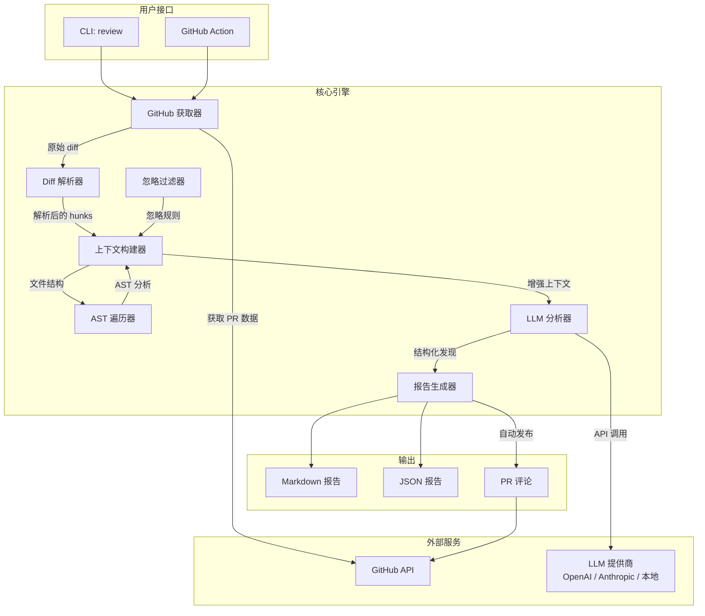
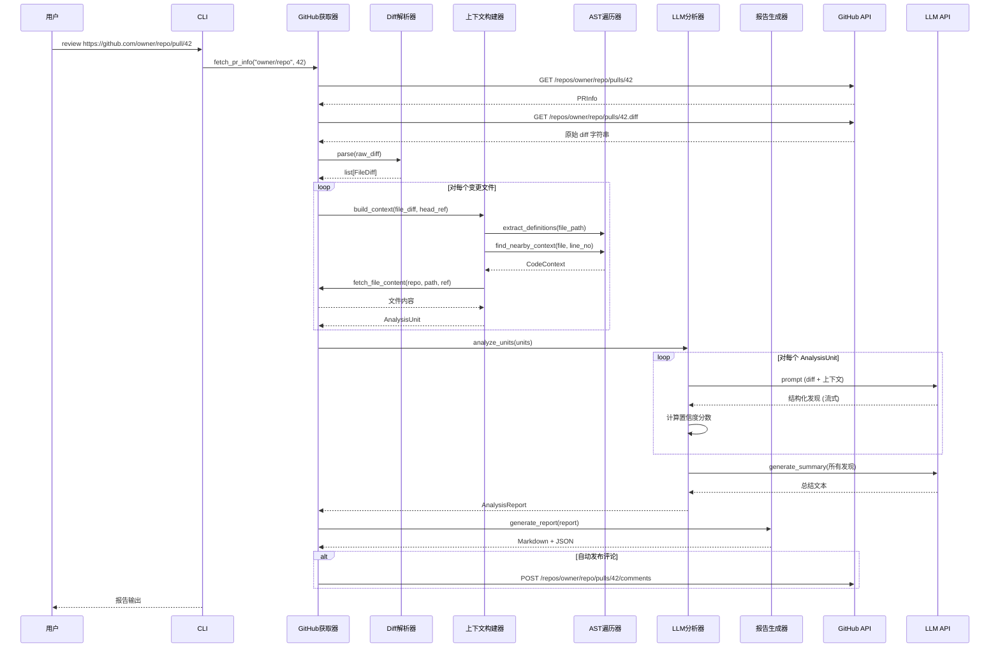

# ai-pr-reviewer — 架构设计文档

> **版本**: 0.1.0  
> **作者**: AI-PR-Reviewer Team  
> **最后更新**: 2026-05-30

---

## 目录

1. [系统概览](#1-系统概览)
2. [核心模块接口定义](#2-核心模块接口定义)
3. [数据流](#3-数据流)
4. [Token 优化策略](#4-token-优化策略)
5. [上下文窗口管理](#5-上下文窗口管理)
6. [Prompt 架构](#6-prompt-架构)
7. [错误处理与可靠性](#7-错误处理与可靠性)
8. [配置系统](#8-配置系统)
9. [项目文件结构](#9-项目文件结构)
10. [未来架构扩展](#10-未来架构扩展)

---

## 1. 系统概览



### 设计原则

1. **关注点分离**：每个模块只有单一职责，通过明确定义的接口通信
2. **Provider 抽象**：LLM 提供商可通过统一接口切换，分析代码不包含任何提供商特定逻辑
3. **Token 优先设计**：所有数据结构和管道决策都基于 Token 预算，而非便利性
4. **纵深防御**：多层质量控制——置信度评分、忽略规则、重试逻辑和校验

---

## 2. 核心模块接口定义

### 2.1 GitHub 获取器 (`github_client/fetcher.py`)

```python
@dataclass
class PRInfo:
    repo_full_name: str        # "owner/repo"
    pr_number: int
    title: str
    description: str
    base_branch: str
    head_branch: str
    author: str
    changed_files: list[str]
    created_at: datetime

@dataclass
class PRDiff:
    repo_full_name: str
    pr_number: int
    raw_diff: str                    # GitHub 返回的原始 diff 字符串
    files: list[FileDiff]            # 解析后的文件级 diff
    stats: DiffStats

@dataclass
class DiffStats:
    total_files: int
    total_additions: int
    total_deletions: int
    total_changed_lines: int

class GitHubFetcher:
    """从 GitHub 获取 PR 数据和 diff"""
    
    def __init__(self, auth_token: str, base_url: str = "https://api.github.com"):
    
    def fetch_pr_info(self, repo: str, pr_number: int) -> PRInfo:
        """获取 PR 元数据"""
    
    def fetch_diff(self, repo: str, pr_number: int) -> PRDiff:
        """获取完整的 PR diff"""
    
    def fetch_file_content(self, repo: str, path: str, ref: str) -> str:
        """获取指定 ref 下某个文件的内容（用于构建上下文）"""
    
    def post_comment(self, repo: str, pr_number: int, body: str) -> None:
        """在 PR 上发布评论"""
    
    def post_review_comment(
        self, repo: str, pr_number: int, body: str,
        commit_id: str, path: str, line: int
    ) -> None:
        """在特定代码行发布内联评论"""
    
    def get_rate_limit_status(self) -> dict:
        """查看剩余 API 配额"""
```

### 2.2 Diff 解析器 (`diff/parser.py`)

```python
@dataclass
class Hunk:
    source_start: int        # 原文件起始行
    source_count: int        # 原文件行数
    target_start: int        # 新文件起始行
    target_count: int        # 新文件行数
    heading: str             # hunk 头部文本
    lines: list["DiffLine"]

@dataclass
class DiffLine:
    content: str
    line_type: Literal["added", "removed", "context"]
    old_line_no: int | None
    new_line_no: int | None

@dataclass
class FileDiff:
    source_file: str         # "a/path/to/file.py"
    target_file: str         # "b/path/to/file.py"
    status: Literal["added", "deleted", "modified", "renamed"]
    hunks: list[Hunk]
    additions: int
    deletions: int
    similarity: float | None  # 重命名时的相似度

class DiffParser:
    """将原始 unified diff 字符串解析为结构化的 FileDiff 对象"""
    
    def parse(self, raw_diff: str) -> list[FileDiff]:
        """解析原始 Git diff"""
    
    def parse_single_file(self, raw_diff: str, file_path: str) -> FileDiff | None:
        """从多文件 diff 中提取单个文件的变更"""
    
    def get_changed_lines(self, file_diff: FileDiff) -> set[tuple[str, int]]:
        """获取 (文件路径, 新行号) 集合，用于增量分析"""
    
    def classify_change_type(self, file_diff: FileDiff) -> str:
        """对变更类型进行分类：重构、新功能、修复、测试、文档、配置"""
```

### 2.3 AST 遍历器 (`context/ast_walker.py`)

```python
@dataclass
class SymbolDefinition:
    name: str
    kind: Literal["function", "class", "method", "variable", "import"]
    file_path: str
    start_line: int
    end_line: int
    docstring: str | None
    signature: str         # 如 "def train_model(data: Dataset, epochs: int) -> Model"

@dataclass
class CodeContext:
    symbols: list[SymbolDefinition]
    imports: list[str]
    nearby_definitions: list[SymbolDefinition]   # 变更附近 50 行内的定义
    referenced_symbols: list[SymbolDefinition]    # 变更代码引用的符号

class ASTWalker:
    """遍历 Python AST 提取符号定义和引用"""
    
    def extract_definitions(self, file_path: str, content: str) -> list[SymbolDefinition]:
        """提取文件中的所有函数/类/变量定义"""
    
    def find_nearby_context(self, file_path: str, content: str, line_no: int) -> CodeContext:
        """查找某行所在的函数/类及附近的定义"""
    
    def resolve_reference(self, file_path: str, symbol_name: str, repo_files: dict) -> SymbolDefinition | None:
        """跨文件解析符号引用到其定义"""
    
    def get_file_dependencies(self, file_path: str, content: str) -> list[str]:
        """提取 import 语句以了解文件依赖关系"""
```

### 2.4 上下文构建器 (`context/builder.py`)

```python
@dataclass
class AnalysisUnit:
    """一个自包含的分析单元，供 LLM 使用"""
    file_diff: FileDiff
    file_before: str                 # 原始文件内容（截断后）
    file_after: str                  # 新文件内容（截断后）
    relevant_context: CodeContext    # AST 派生的上下文
    estimated_tokens: int

class ContextBuilder:
    """构建优化后的 LLM 分析上下文"""

    def __init__(self, repo_full_name: str, fetcher: GitHubFetcher, ast_walker: ASTWalker):
    
    async def build_analysis_units(
        self,
        file_diffs: list[FileDiff],
        max_tokens_per_unit: int = 6000
    ) -> list[AnalysisUnit]:
        """将 diff 按 Token 预算分割为分析单元"""
    
    def _should_include_file(self, file_path: str, ignore_rules: IgnoreRules) -> bool:
        """检查文件是否被忽略规则排除"""
    
    async def _build_context_for_file(
        self, file_diff: FileDiff, head_ref: str
    ) -> CodeContext:
        """获取并分析变更文件的上下文"""
    
    def _truncate_to_token_budget(
        self, content: str, max_tokens: int
    ) -> str:
        """截断内容以适应 Token 预算"""
```

### 2.5 LLM 分析器 (`llm/analyzer.py`)

```python
@dataclass
class Finding:
    file_path: str
    line_start: int | None
    line_end: int | None
    severity: Literal["critical", "major", "minor", "info"]
    category: Literal[
        "security", "performance", "bug", "concurrency",
        "error_handling", "code_style", "maintainability",
        "best_practice", "potential_issue"
    ]
    title: str                              # 简短可操作的标题
    description: str                        # 详细说明
    suggestion: str                         # 具体修改建议
    confidence: float                       # 0.0 - 1.0
    code_example: str | None               # 修改前后的代码片段

@dataclass
class AnalysisReport:
    summary: str                            # 自然语言 PR 总结
    findings: list[Finding]
    stats: AnalysisStats
    metadata: AnalysisMetadata

class LLMAnalyzer:
    """核心分析引擎，协调 Prompt 构建和 LLM 调用"""

    def __init__(self, provider: str, model: str, api_key: str, **kwargs):
    
    async def analyze_unit(self, unit: AnalysisUnit) -> list[Finding]:
        """分析单个分析单元并返回发现"""
    
    async def generate_summary(self, units: list[AnalysisUnit], all_findings: list[Finding]) -> str:
        """从所有分析结果生成 PR 总结"""
    
    def _construct_diff_prompt(self, unit: AnalysisUnit) -> list[dict]:
        """构建 diff 分析的 Prompt"""
    
    def _construct_summary_prompt(self, findings: list[Finding]) -> list[dict]:
        """构建 PR 总结的 Prompt"""
```

### 2.6 报告生成器 (`report/generator.py`)

```python
class ReportGenerator:
    """从分析结果生成结构化报告"""

    def generate_markdown(self, report: AnalysisReport) -> str:
        """生成适合 PR 评论的 Markdown 报告"""
    
    def generate_json(self, report: AnalysisReport) -> dict:
        """生成适合 CI/CD 的 JSON 报告"""
    
    def generate_github_comment(self, report: AnalysisReport) -> str:
        """生成优化过的 GitHub Markdown 评论"""
```

---

## 3. 数据流



---

## 4. Token 优化策略

Token 效率是核心工程挑战。一个大的 PR 可能包含 10,000+ 行 diff，远超任何 LLM 的上下文窗口。我们的策略：

### 4.1 多级分块

```
PR (原始 diff)
├── 第 0 级: PR 元数据 + 总结 Prompt (~500 tokens)
├── 第 1 级: 每个文件单独分析 (最多 6,000 tokens 每个)
│   ├── 文件 1: src/main.py (4,200 tokens)
│   ├── 文件 2: src/utils.py (5,800 tokens)
│   └── 文件 3: tests/test_main.py (2,100 tokens)
├── 第 2 级: 跨文件综合 (~2,000 tokens)
└── 第 3 级: 最终报告生成 (~1,000 tokens)
```

### 4.2 块内内容优先级

当需要截断时，按以下顺序删除内容（最先删除 = 最不重要）：

1. **空行和尾部空格**（压缩为单行）
2. **注释和文档字符串**（除非包含 API 契约）
3. **未变更的上下文行**（每个 hunk 前后只保留 3 行）
4. **类型注解**（如有需要可从函数签名重建）
5. **import 语句**（只保留变更代码引用的部分）
6. **未变更函数的函数体**（只保留签名）

### 4.3 增量 Diff 分析

```
策略：只分析新增和修改的代码行。

- 新增行：完整分析（100% 关注）
- 修改行：修改前后对比
- 删除行：仅当可能暴露 "错误修复" 时才分析
- 上下文行：每个 hunk 前后缩减至 5 行
```

### 4.4 缓存策略

| 缓存键 | 值 | 有效期 | 用途 |
|--------|-----|--------|------|
| `{repo}:{file_path}:{ref}` | AST 定义 | 1 小时 | 避免重复解析同一文件 |
| `{repo}:{pr_number}:diff` | 解析后的 diff | 10 分钟 | 重试时避免重复拉取 |
| `{repo}:{pr_number}:analysis` | 发现结果 | 30 分钟 | 恢复中断的分析 |

### 4.5 500 行 PR 的 Token 预算估算

| 组件 | Token（估算） | 预算占比 |
|------|---------------|----------|
| 系统 Prompt | 400 | 2% |
| PR 元数据 | 300 | 1.5% |
| Diff 内容（压缩后） | 3,500 | 17.5% |
| 上下文（AST、imports） | 2,000 | 10% |
| **每个文件的分析 Prompt** | **~4,000** | **20%** |
| 总结综合 | 1,000 | 5% |
| **响应（发现）** | ~2,500 | 12.5% |
| **每次分析调用总计** | **~8,000** | — |

> 10 个文件变更（共 500 行），总 Token 消耗 ≈ 25,000（输出）+ 40,000（输入）。gpt-4o（128K）和 claude-opus（200K）都有富余。

---

## 5. 上下文窗口管理

### 5.1 各 Provider 的策略

| Provider | 最大上下文 | 策略 |
|----------|-----------|------|
| Claude Opus 4 | 200K tokens | 大部分 PR 可以单次调用，仅 >150K 时分块 |
| GPT-4o | 128K tokens | 100K 阈值时分块 |
| GPT-4o-mini | 128K tokens | 同 GPT-4o |
| DeepSeek V3 | 64K tokens | 50K 阈值时分块 |
| 本地模型 | 8K-32K tokens | 需要激进分块 |

### 5.2 分块算法

```python
def build_analysis_units(file_diffs, max_tokens=6000):
    units = []
    current_unit = {files: [], tokens: 0}
    
    for file_diff in sorted(file_diffs, key=lambda f: f.additions + f.deletions):
        file_tokens = estimate_tokens(file_diff)
        
        if current_unit.tokens + file_tokens > max_tokens:
            if is_related(file_diff, current_unit.files):
                # 强制包含——将文件拆分为两个单元
                split_file = split_hunks(file_diff, max_tokens - current_unit.tokens)
                current_unit.files.append(split_file.first_half)
                units.append(current_unit)
                current_unit = {files: [split_file.second_half], tokens: split_file.second_half_tokens}
            else:
                units.append(current_unit)
                current_unit = {files: [file_diff], tokens: file_tokens}
        else:
            current_unit.files.append(file_diff)
            current_unit.tokens += file_tokens
    
    if current_unit.files:
        units.append(current_unit)
    
    return units
```

### 5.3 每个单元的内容组装

每个 AnalysisUnit 包含：

```
┌────────────────────────────────────────────┐
│ 系统 Prompt (400 tokens)                    │
│ "你是一位资深代码审查专家..."               │
├────────────────────────────────────────────┤
│ PR 上下文 (200 tokens)                      │
│ PR #42: "修复调度器中的竞态条件"            │
│ 基准: main → 分支: fix/scheduler-race       │
├────────────────────────────────────────────┤
│ 文件上下文 (可变)                           │
│ src/scheduler.py (变更: +45 / -12)          │
│ ├── Imports (截断至相关)                    │
│ ├── 所在类: Scheduler                       │
│ │   ├── def __init__(self, ...)             │
│ │   ├── def schedule(self, task)            │ ← 已变更
│ │   ├── def _acquire_lock(self)             │ ← 已变更
│ │   └── def _release_lock(self)             │ ← 已变更
│ └── 调用方: dispatcher.py:120               │
├────────────────────────────────────────────┤
│ DIFF HUNKS (可变, Token 预算内)             │
│ @@ -45,12 +45,15 @@ class Scheduler:       │
│     def schedule(self, task):               │
│   -     if self._running:                   │
│   -         return False                    │
│   +     async with self._lock:              │
│   +         return await self._execute(…)   │
├────────────────────────────────────────────┤
│ 输出格式 (300 tokens)                       │
│ 发现的 JSON schema                          │
└────────────────────────────────────────────┘
```

---

## 6. Prompt 架构

### 6.1 设计原则

1. **角色专业化**：三种不同的 Prompt 模板（总结、风险分析、建议），各自针对任务优化
2. **结构化输出**：所有 Prompt 要求返回 JSON 格式以便可靠解析
3. **Few-shot 示例**：每个 Prompt 包含 1-2 个领域特定的示例（安全、性能等）
4. **置信度校准**：Prompt 明确要求模型评估自己的置信度并解释不确定性
5. **思维链**：风险分析 Prompt 使用 CoT 减少误报

### 6.2 Prompt 模板

#### 6.2.1 风险分析 Prompt（核心）

```
你是一位资深代码审查专家，对安全漏洞、性能优化、并发编程和语言特定最佳实践有深入了解。

分析以下代码 diff，识别潜在问题。

## 上下文
- 仓库: {repo_name}
- PR #{pr_number}: {pr_title}
- 文件: {file_path}
- 变更类型: {change_type} (新功能 / 修复 / 重构)

## 代码变更

### 文件: {file_path}
{formatted_diff}

### 相关上下文
{nearby_definitions}
{imports}

## 指令

对每个识别到的问题，返回一个 JSON 对象：
{
  "file_path": "{file_path}",
  "line_start": <int 或 null>,
  "line_end": <int 或 null>,
  "severity": "critical" | "major" | "minor" | "info",
  "category": "security" | "performance" | "bug" | "concurrency" |
              "error_handling" | "code_style" | "maintainability" |
              "best_practice" | "potential_issue",
  "title": "<简短、可操作的标题>",
  "description": "<问题的详细说明，包括为什么重要>",
  "suggestion": "<具体、明确的修复或改进>",
  "code_example": "<如适用，提供修改前后的代码片段>",
  "confidence": <0.0-1.0>,
  "uncertainty_reason": "<如果置信度 < 0.8，说明需要哪些额外信息>"
}

## 质量控制规则
- 只报告你高度确定的问题（置信度 >= 0.7）
- 置信度 < 0.7 的问题仍可包含，但 severity 设为 "info"
- 如果代码没有发现问题，返回空数组
- 不要将代码风格偏好报告为 Bug
- 考虑 diff 的上下文——单独的变更可能看起来不对，但在上下文中是正确的
- 特别关注缺失的错误处理，尤其是 I/O、网络调用和用户输入
```

**设计理由**：
- Prompt 中明确的 JSON schema 确保可解析的输出，不依赖 function calling
- 置信度评分提供内置的误报过滤器
- "uncertainty_reason" 字段为我们提供了改进上下文收集的路径
- 质量控制规则作为对常见 LLM 审查陷阱的护栏

#### 6.2.2 总结 Prompt

```
用自然语言总结以下 Pull Request 审查发现。

PR: #{pr_number} - {pr_title}
变更文件: {file_count} 个, +{additions}/-{deletions}

## 发现汇总
{findings_aggregated}

## 指令
写一份简洁的总结（2-4 段），涵盖：
1. **业务意图**：这个 PR 试图实现什么？
2. **技术方案**：它如何解决问题？
3. **关键风险**：1-2 个最需要关注的关键问题
4. **总体评估**：PR 是否可合并？（批准 / 需要修改 / 需重新审查）

使用 Markdown 标题格式化以提高可读性。
```

#### 6.2.3 建议 Prompt（针对每个发现）

```
针对以下发现，生成具体的代码修改建议。

## 发现
- 文件: {file_path}:{line_start}
- 问题: {title}
- 描述: {description}

## 当前代码
```{language}
{current_code}
```

## 指令
提供具体、可操作的修复方案。包括：
1. 需要修改的确切代码
2. 为什么这个修复有效
3. 需要考虑的边界情况

返回 JSON:
{
  "suggestion": "<详细解释>",
  "before": "<当前代码>",
  "after": "<修复后代码>",
  "risk_of_fix": "低" | "中" | "高",
  "alternative_approaches": ["<替代方案1>", "<替代方案2>"]
}
```

---

## 7. 错误处理与可靠性

### 7.1 重试策略

```python
RETRY_CONFIG = {
    "github_api": {
        "max_retries": 3,
        "backoff": "exponential",
        "base_delay": 1.0,
        "retry_on_status": [429, 500, 502, 503],
    },
    "llm_api": {
        "max_retries": 3,
        "backoff": "exponential_with_jitter",
        "base_delay": 2.0,
        "retry_on_status": [429, 500, 502, 503],
        "timeout": 120,
    },
    "rate_limit_handling": {
        "wait_for_reset": True,
        "fallback_to_basic": True,  # 遇到重复 429 时减少上下文
    }
}
```

### 7.2 降级模式

| 条件 | 行为 |
|------|------|
| GitHub API 限流 | 等待重置，或回退到原始 diff URL |
| LLM 上下文超限 | 减少上下文行数，删除非必需文件 |
| LLM 超时 | 用更小的块重试，3 次失败则跳过 |
| AST 解析失败 | 回退到文件扩展名 + 正则表达式上下文 |
| 文件内容获取失败 | 跳过上下文增强，仅分析 diff |
| 部分分析失败 | 继续分析剩余文件，报告部分成功 |

### 7.3 日志

```python
LOGGING_CONFIG = {
    "version": 1,
    "handlers": {
        "console": {"level": "INFO", "formatter": "rich"},
        "file": {"level": "DEBUG", "filename": "pr_reviewer.log"},
    },
    "loggers": {
        "pr_reviewer.github": {"level": "DEBUG"},
        "pr_reviewer.llm": {"level": "INFO"},
        "pr_reviewer.ast": {"level": "DEBUG"},
        "pr_reviewer.report": {"level": "INFO"},
    }
}
```

---

## 8. 配置系统

### 8.1 CLI 配置

```yaml
# .ai-review-config.yaml
provider: anthropic
model: claude-sonnet-4-20250514
api_key_env: ANTHROPIC_API_KEY  # 从环境变量读取

github:
  auth_type: pat                  # pat | app
  token_env: GITHUB_TOKEN

analysis:
  min_confidence: 0.7
  max_context_tokens: 6000
  severity_threshold: minor       # 最低报告的严重级别
  max_files: 50                   # 最大分析文件数
  enable_ast_context: true
  enable_cross_file_analysis: true

output:
  format: markdown                # markdown | json | both
  auto_comment: false             # 自动发布到 PR
  color: true
```

### 8.2 忽略规则 (`.ai-review-ignore`)

```gitignore
# .ai-review-ignore
# 要跳过的文件模式
*.generated.py
**/migrations/*
**/vendor/*
**/*.min.js
**/__snapshots__/*

# 要禁用的特定规则
rule:no-console-log
rule:style-preference

# 每路径的严重级别上限
[threshold:major]
**/test/**
**/docs/**
```

---

## 9. 项目文件结构

```
ai-pr-reviewer/
├── DESIGN.md                          # 本文档
├── README.md                          # 用户文档
├── DESIGN_RATIONALE.md                # 设计权衡与反思
├── pyproject.toml                     # 项目元数据和依赖
├── setup.py                           # 安装脚本
├── .ai-review-config.yaml             # 默认配置
│
├── src/
│   ├── __init__.py
│   ├── cli.py                         # Click CLI 入口
│   ├── cli_utils.py                   # Rich 进度条、重试、控制台助手
│   ├── config.py                      # 配置管理
│   │
│   ├── github_client/
│   │   ├── __init__.py
│   │   ├── fetcher.py                 # GitHub API 客户端（PR 获取）
│   │   └── auth.py                    # 认证（PAT / App）
│   │
│   ├── diff/
│   │   ├── __init__.py
│   │   ├── parser.py                  # Unified diff 解析
│   │   └── models.py                  # Diff 数据模型
│   │
│   ├── context/
│   │   ├── __init__.py
│   │   ├── builder.py                 # 上下文组装
│   │   ├── ast_walker.py             # Python AST 分析
│   │   └── ignore.py                 # 忽略规则引擎
│   │
│   ├── llm/
│   │   ├── __init__.py
│   │   ├── analyzer.py               # 核心分析引擎
│   │   ├── prompts.py                 # Prompt 模板
│   │   ├── token_counter.py          # Token 估算工具
│   │   └── providers/
│   │       ├── __init__.py
│   │       ├── base.py                # 抽象 Provider
│   │       ├── anthropic_provider.py  # Anthropic 实现
│   │       ├── openai_provider.py     # OpenAI 实现
│   │       └── local_provider.py      # 本地模型（Ollama 等）
│   │
│   └── report/
│       ├── __init__.py
│       ├── generator.py               # 报告生成（MD/JSON）
│       └── templates.py               # 报告模板
│
├── tests/
│   ├── __init__.py
│   ├── conftest.py                    # 共享 fixtures
│   ├── fixtures/                      # 测试数据
│   │   ├── sample_diff_simple.txt
│   │   ├── sample_diff_multifile.txt
│   │   └── sample_diff_security.txt
│   ├── test_diff_parser.py
│   ├── test_ast_walker.py
│   ├── test_config.py
│   ├── test_ignore.py
│   ├── test_analyzer.py
│   ├── test_prompts.py
│   ├── test_report_generator.py
│   ├── test_token_counter.py
│   └── test_github_fetcher.py
│
└── examples/
    ├── report_sample.md
    └── report_sample.json
```

---

## 10. 未来架构扩展

### 后续阶段扩展（不在当前范围）

- **多文件依赖分析**：当文件 A 的变更影响文件 B（如接口变更）时，自动检测并分析影响
- **历史学习**：从过去的 PR 审查中学习，为每个项目调整置信度阈值
- **自定义规则引擎**：允许团队定义基于正则/AST 的自定义规则，不依赖 LLM
- **CI 原生集成**：GitHub Action、GitLab CI、Bitbucket Pipelines 封装
- **审查记忆**：缓存之前的审查决策，避免重复标记已讨论过的问题
- **本地优先**：使用本地 LLM 和预获取的仓库数据实现完全离线模式

---

> **架构设计文档结束**
>
> 下一步：Phase 2 — 核心实现
