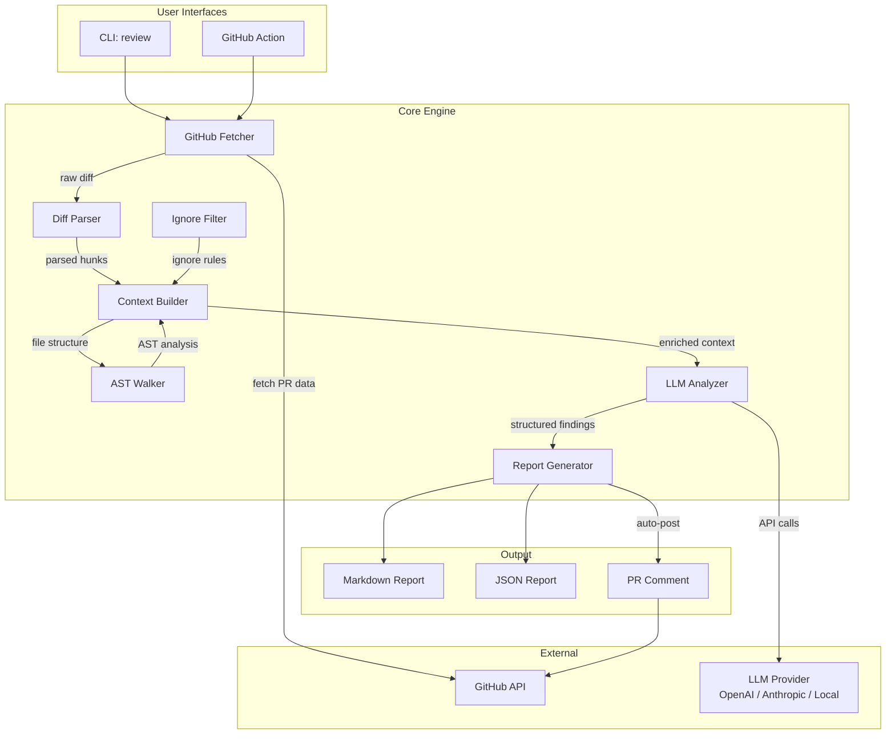
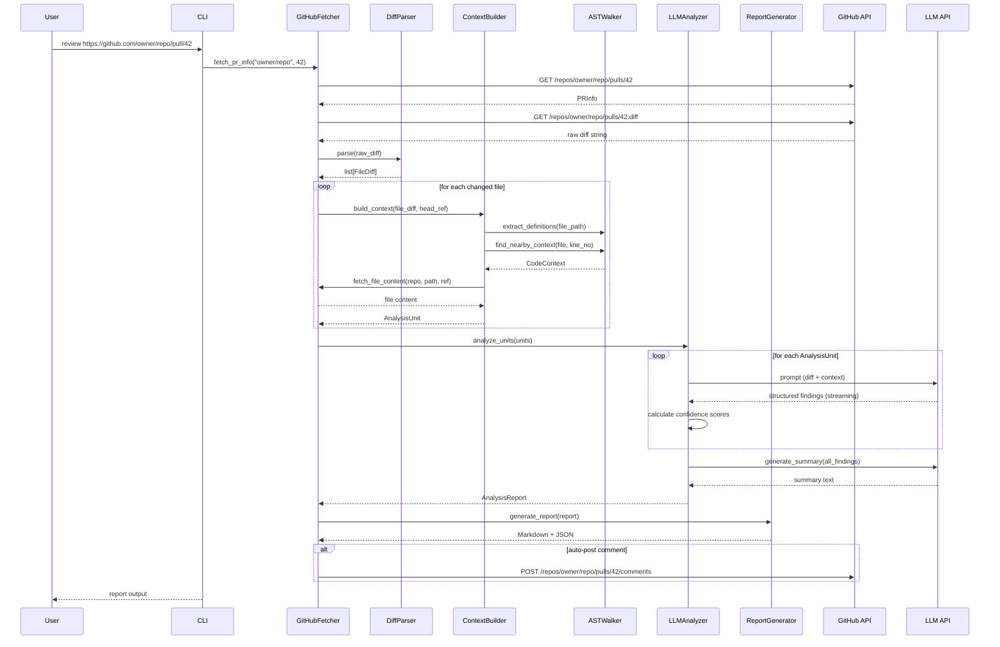

# ai-pr-reviewer — Architecture Design

> **Version**: 0.1.0  
> **Author**: AI-PR-Reviewer Team  
> **Last Updated**: 2026-05-30

---

## Table of Contents

1. [System Overview](#1-system-overview)
2. [Core Module Interfaces](#2-core-module-interfaces)
3. [Data Flow](#3-data-flow)
4. [Token Optimization Strategy](#4-token-optimization-strategy)
5. [Context Window Management](#5-context-window-management)
6. [Prompt Architecture](#6-prompt-architecture)
7. [Error Handling & Reliability](#7-error-handling--reliability)
8. [Configuration System](#8-configuration-system)
9. [Project File Structure](#9-project-file-structure)

---

## 1. System Overview



### Design Principles

1. **Separation of Concerns**: Each module has a single responsibility and communicates through well-defined interfaces.
2. **Provider Abstraction**: LLM providers are swappable behind a common interface — no provider-specific logic leaks into analysis code.
3. **Token-First Design**: Every data structure and pipeline decision is made with token budgets in mind, not convenience.
4. **Defense in Depth**: Multiple layers of quality control — confidence scoring, ignore rules, retry logic, and validation.

---

## 2. Core Module Interfaces

### 2.1 GitHub Fetcher (`github_fetcher.py`)

```python
@dataclass
class PRInfo:
    repo_full_name: str        # "owner/repo"
    pr_number: int
    title: str
    description: str
    base_branch: str
    head_branch: str
    author: str
    changed_files: list[str]
    created_at: datetime

@dataclass
class PRDiff:
    repo_full_name: str
    pr_number: int
    raw_diff: str                    # raw diff string from GitHub
    files: list[FileDiff]            # parsed file-level diffs
    stats: DiffStats

@dataclass
class DiffStats:
    total_files: int
    total_additions: int
    total_deletions: int
    total_changed_lines: int

class GitHubFetcher:
    """Fetch PR data and diffs from GitHub."""
    
    def __init__(self, auth_token: str, base_url: str = "https://api.github.com"):
    
    def fetch_pr_info(self, repo: str, pr_number: int) -> PRInfo:
        """Fetch PR metadata."""
    
    def fetch_diff(self, repo: str, pr_number: int) -> PRDiff:
        """Fetch the full PR diff as a structured object."""
    
    def fetch_file_content(self, repo: str, path: str, ref: str) -> str:
        """Fetch a specific file at a given ref (for context building)."""
    
    def post_comment(self, repo: str, pr_number: int, body: str) -> None:
        """Post a review comment on the PR."""
    
    def post_review_comment(
        self, repo: str, pr_number: int, body: str,
        commit_id: str, path: str, line: int
    ) -> None:
        """Post an inline review comment on a specific line."""
    
    def get_rate_limit_status(self) -> dict:
        """Check remaining API quota."""
```

### 2.2 Diff Parser (`diff_parser.py`)

```python
@dataclass
class Hunk:
    source_start: int        # original file line start
    source_count: int        # original file line count
    target_start: int        # new file line start
    target_count: int        # new file line count
    heading: str             # hunk header text
    lines: list["DiffLine"]

@dataclass
class DiffLine:
    content: str
    line_type: Literal["added", "removed", "context"]
    old_line_no: int | None
    new_line_no: int | None

@dataclass
class FileDiff:
    source_file: str         # "a/path/to/file.py"
    target_file: str         # "b/path/to/file.py"
    status: Literal["added", "deleted", "modified", "renamed"]
    hunks: list[Hunk]
    additions: int
    deletions: int
    similarity: float | None  # for renames

class DiffParser:
    """Parse raw unified diff strings into structured FileDiff objects."""
    
    def parse(self, raw_diff: str) -> list[FileDiff]:
        """Parse a raw Git diff into structured file diffs."""
    
    def parse_single_file(self, raw_diff: str, file_path: str) -> FileDiff | None:
        """Extract diff for a single file."""
    
    def get_changed_lines(self, file_diff: FileDiff) -> set[tuple[str, int]]:
        """Get set of (file_path, new_line_number) for changed lines."""
    
    def classify_change_type(self, file_diff: FileDiff) -> str:
        """Classify change as: refactor, feature, bugfix, test, docs, config."""
```

### 2.3 AST Walker (`ast_walker.py`)

```python
@dataclass
class SymbolDefinition:
    name: str
    kind: Literal["function", "class", "method", "variable", "import"]
    file_path: str
    start_line: int
    end_line: int
    docstring: str | None
    signature: str         # e.g., "def train_model(data: Dataset, epochs: int) -> Model"

@dataclass
class CodeContext:
    symbols: list[SymbolDefinition]
    imports: list[str]
    nearby_definitions: list[SymbolDefinition]   # defs within 50 lines of change
    referenced_symbols: list[SymbolDefinition]    # symbols referenced by changed code

class ASTWalker:
    """Walk Python AST to extract symbol definitions and references."""
    
    def extract_definitions(self, file_path: str, content: str) -> list[SymbolDefinition]:
        """Extract all function/class/variable definitions from a file."""
    
    def find_nearby_context(self, file_path: str, content: str, line_no: int) -> CodeContext:
        """Find the enclosing function/class and nearby definitions for a line."""
    
    def resolve_reference(self, file_path: str, symbol_name: str, repo_files: dict) -> SymbolDefinition | None:
        """Resolve a symbol reference to its definition across the repo."""
    
    def get_file_dependencies(self, file_path: str, content: str) -> list[str]:
        """Extract import statements to understand file dependencies."""
```

### 2.4 Context Builder (`context_builder.py`)

```python
@dataclass
class AnalysisUnit:
    """A self-contained unit of analysis for the LLM."""
    file_diff: FileDiff
    file_before: str                 # original file content (truncated)
    file_after: str                  # new file content (truncated)
    relevant_context: CodeContext    # AST-derived context
    estimated_tokens: int

class ContextBuilder:
    """Build optimized context for LLM analysis."""

    def __init__(self, repo_full_name: str, fetcher: GitHubFetcher, ast_walker: ASTWalker):
    
    async def build_analysis_units(
        self,
        file_diffs: list[FileDiff],
        max_tokens_per_unit: int = 6000
    ) -> list[AnalysisUnit]:
        """Split diffs into token-budgeted analysis units."""
    
    def _should_include_file(self, file_path: str, ignore_rules: IgnoreRules) -> bool:
        """Check if file passes ignore rules."""
    
    async def _build_context_for_file(
        self, file_diff: FileDiff, head_ref: str
    ) -> CodeContext:
        """Fetch and analyze context for a changed file."""
    
    def _truncate_to_token_budget(
        self, content: str, max_tokens: int
    ) -> str:
        """Truncate content to fit within token budget."""
```

### 2.5 LLM Analyzer (`llm_analyzer.py`)

```python
@dataclass
class Finding:
    file_path: str
    line_start: int | None
    line_end: int | None
    severity: Literal["critical", "major", "minor", "info"]
    category: Literal[
        "security", "performance", "bug", "concurrency",
        "error_handling", "code_style", "maintainability",
        "best_practice", "potential_issue"
    ]
    title: str                              # short, actionable title
    description: str                        # detailed explanation
    suggestion: str                         # concrete code suggestion
    confidence: float                       # 0.0 - 1.0
    code_example: str | None               # before/after code snippet

@dataclass
class AnalysisReport:
    summary: str                            # natural language PR summary
    findings: list[Finding]
    stats: AnalysisStats
    metadata: AnalysisMetadata

@dataclass
class AnalysisStats:
    total_findings: int
    by_severity: dict[str, int]
    by_category: dict[str, int]
    high_confidence_count: int

class LLMAnalyzer:
    """Core analysis engine that coordinates prompt construction and LLM calls."""

    def __init__(self, provider: str, model: str, api_key: str, **kwargs):
    
    async def analyze_unit(self, unit: AnalysisUnit) -> list[Finding]:
        """Analyze a single analysis unit and return findings."""
    
    async def generate_summary(self, units: list[AnalysisUnit], all_findings: list[Finding]) -> str:
        """Generate an overall PR summary from all analysis results."""
    
    def _construct_diff_prompt(self, unit: AnalysisUnit) -> list[dict]:
        """Build the prompt for diff analysis."""
    
    def _construct_summary_prompt(self, findings: list[Finding]) -> list[dict]:
        """Build the prompt for PR summary generation."""
```

### 2.6 Report Generator (`report_generator.py`)

```python
@dataclass
class IgnoreRules:
    patterns: list[str]          # glob patterns to ignore
    rule_ids: list[str]          # specific rule IDs to skip
    severity_threshold: float    # minimum confidence to report

class IgnoreFilter:
    """Parse .ai-review-ignore files and filter findings."""
    
    def __init__(self, repo_path: str):
    
    def load_rules(self) -> IgnoreRules:
        """Load .ai-review-ignore from repo root."""
    
    def filter_findings(self, findings: list[Finding]) -> list[Finding]:
        """Remove findings matching ignore rules."""

class ReportGenerator:
    """Generate structured reports from analysis results."""

    def generate_markdown(self, report: AnalysisReport) -> str:
        """Generate a formatted Markdown report for PR comments."""
    
    def generate_json(self, report: AnalysisReport) -> dict:
        """Generate a JSON-serializable report for CI/CD."""
    
    def generate_github_comment(self, report: AnalysisReport) -> str:
        """Generate an optimized Markdown comment for GitHub."""
```

---

## 3. Data Flow



---

## 4. Token Optimization Strategy

Token efficiency is the core engineering challenge. A single large PR can contain 10,000+ lines of diff, far exceeding any LLM context window. Our strategy:

### 4.1 Multi-Level Chunking

```
PR (raw diff)
├── Chunk Level 0: PR Metadata + Summary Prompt (~500 tokens)
├── Chunk Level 1: Per-File Analysis (up to 6,000 tokens each)
│   ├── File 1: src/main.py (4,200 tokens)
│   ├── File 2: src/utils.py (5,800 tokens)
│   └── File 3: tests/test_main.py (2,100 tokens)
├── Chunk Level 2: Cross-File Synthesis (~2,000 tokens)
└── Chunk Level 3: Final Report Generation (~1,000 tokens)
```

### 4.2 Content Prioritization Within a Chunk

When truncating is necessary, content is dropped in this order (first removed = least important):

1. **Blank lines and trailing whitespace** (compress to single lines)
2. **Comments and docstrings** (unless they carry API contracts)
3. **Unchanged context lines** (keep only 3 lines before/after each hunk)
4. **Type annotations** (reconstruct from function signature if needed)
5. **Import statements** (keep only those referenced by changed code)
6. **Function bodies** in non-changed functions (keep only signatures)

### 4.3 Incremental Diff Analysis

```
Strategy: Only analyze NEW and MODIFIED code lines.

- Added lines: Full analysis (100% attention)
- Modified lines: Before/after comparison
- Deleted lines: Only analyzed if they reveal a bug being "fixed" wrongly
- Context lines: Trimmed to 5 lines before/after each hunk
```

### 4.4 Caching Strategy

| Cache Key | Value | TTL | Purpose |
|-----------|-------|-----|---------|
| `{repo}:{file_path}:{ref}` | AST definitions | 1 hour | Avoid re-parsing same file |
| `{repo}:{pr_number}:diff` | Parsed diff | 10 min | Avoid re-fetching during retry |
| `{repo}:{pr_number}:analysis` | Findings | 30 min | Resume interrupted analysis |

### 4.5 Estimated Token Budget for a 500-line PR

| Component | Tokens (est.) | % of Budget |
|-----------|---------------|-------------|
| System prompt | 400 | 2% |
| PR metadata | 300 | 1.5% |
| Diff content (compressed) | 3,500 | 17.5% |
| Context (AST, imports) | 2,000 | 10% |
| **Analysis prompt per file** | **~4,000** | **20%** |
| Summary synthesis | 1,000 | 5% |
| **Response** (findings) | ~2,500 | 12.5% |
| **Total per analysis call** | **~8,000** | — |

> With 10 files changed (500 lines total), total token consumption ≈ 25,000 tokens (output) + 40,000 tokens (input). Well within budget for gpt-4o (128K) or claude-opus (200K).

---

## 5. Context Window Management

### 5.1 Provider-Specific Strategies

| Provider | Max Context | Strategy |
|----------|-------------|----------|
| Claude Opus 4 | 200K tokens | Can handle most PRs in single call; chunk only >150K |
| GPT-4o | 128K tokens | Chunk at 100K threshold |
| GPT-4o-mini | 128K tokens | Same as GPT-4o |
| DeepSeek V3 | 64K tokens | Chunk at 50K threshold |
| Local models | 8K-32K tokens | Aggressive chunking required |

### 5.2 Chunking Algorithm

```python
def build_analysis_units(file_diffs, max_tokens=6000):
    units = []
    current_unit = {files: [], tokens: 0}
    
    for file_diff in sorted(file_diffs, key=lambda f: f.additions + f.deletions):
        file_tokens = estimate_tokens(file_diff)
        
        if current_unit.tokens + file_tokens > max_tokens:
            # Start a new unit, but keep related files together
            if is_related(file_diff, current_unit.files):
                # Force include — split the file across units instead
                split_file = split_hunks(file_diff, max_tokens - current_unit.tokens)
                current_unit.files.append(split_file.first_half)
                units.append(current_unit)
                current_unit = {files: [split_file.second_half], tokens: split_file.second_half_tokens}
            else:
                units.append(current_unit)
                current_unit = {files: [file_diff], tokens: file_tokens}
        else:
            current_unit.files.append(file_diff)
            current_unit.tokens += file_tokens
    
    if current_unit.files:
        units.append(current_unit)
    
    return units
```

### 5.3 Context Assembly Per Unit

Each AnalysisUnit contains:

```
┌────────────────────────────────────────────┐
│ SYSTEM PROMPT (400 tokens)                 │
│ "You are an expert code reviewer..."       │
├────────────────────────────────────────────┤
│ PR CONTEXT (200 tokens)                    │
│ PR #42: "Fix race condition in scheduler"  │
│ Base: main → Head: fix/scheduler-race      │
├────────────────────────────────────────────┤
│ FILE CONTEXT (variable)                    │
│ src/scheduler.py (changed: +45 / -12)      │
│ ├── Imports (truncated to relevant)        │
│ ├── Enclosing class: Scheduler             │
│ │   ├── def __init__(self, ...)            │
│ │   ├── def schedule(self, task)           │ ← changed
│ │   ├── def _acquire_lock(self)            │ ← changed
│ │   └── def _release_lock(self)            │ ← changed
│ └── Callers: dispatcher.py:120             │
├────────────────────────────────────────────┤
│ DIFF HUNKS (variable, token-budgeted)      │
│ @@ -45,12 +45,15 @@ class Scheduler:       │
│     def schedule(self, task):              │
│   -     if self._running:                  │
│   -         return False                   │
│   +     async with self._lock:             │
│   +         return await self._execute(…)  │
├────────────────────────────────────────────┤
│ OUTPUT FORMAT (300 tokens)                 │
│ JSON schema for findings                   │
└────────────────────────────────────────────┘
```

---

## 6. Prompt Architecture

### 6.1 Design Principles

1. **Role specialization**: Three distinct prompt templates (summary, risk analysis, suggestion), each optimized for its task.
2. **Structured output**: All prompts request JSON-formatted responses for reliable parsing.
3. **Few-shot examples**: Each prompt includes 1-2 domain-specific examples (security, performance, etc.).
4. **Confidence calibration**: Prompts explicitly ask the model to rate its confidence and explain uncertainty.
5. **Chain-of-thought**: Risk analysis prompt uses CoT to reduce false positives.

### 6.2 Prompt Templates

#### 6.2.1 Risk Analysis Prompt (Core)

```
You are an expert code reviewer with deep knowledge of security vulnerabilities,
performance optimization, concurrent programming, and language-specific best practices.

Analyze the following code diff and identify potential issues.

## Context
- Repository: {repo_name}
- PR #{pr_number}: {pr_title}
- File: {file_path}
- Change type: {change_type} (new_feature / bugfix / refactor)

## Code Changes

### File: {file_path}
{formatted_diff}

### Relevant Context
{nearby_definitions}
{imports}

## Instructions

For each issue you identify, respond with a JSON object:
{
  "file_path": "{file_path}",
  "line_start": <int or null>,
  "line_end": <int or null>,
  "severity": "critical" | "major" | "minor" | "info",
  "category": "security" | "performance" | "bug" | "concurrency" | 
              "error_handling" | "code_style" | "maintainability" | 
              "best_practice" | "potential_issue",
  "title": "<short, actionable title>",
  "description": "<detailed explanation of the issue, including why it matters>",
  "suggestion": "<concrete, specific fix or improvement>",
  "code_example": "<before/after code snippet if applicable>",
  "confidence": <0.0-1.0>,
  "uncertainty_reason": "<if confidence < 0.8, explain what additional info would help>"
}

## Quality Rules
- Only report issues you are highly confident about (confidence >= 0.7).
- For confidence < 0.7, still include them but set severity to "info".
- If the change is clean and no issues found, return an empty array.
- DO NOT report style preferences as bugs unless they affect readability significantly.
- Consider the diff in context — a standalone change may look wrong but be correct in context.
- Flag missing error handling, especially around I/O, network calls, and user input.
```

**Design rationale**: 
- The explicit JSON schema in the prompt ensures parseable output without function-calling dependencies
- Confidence scoring provides a built-in false-positive filter
- The "uncertainty_reason" field gives us a path to improve context gathering
- The quality rules act as guardrails against common LLM review pitfalls

#### 6.2.2 Summary Prompt

```
Summarize the following Pull Request review findings in natural language.

PR: #{pr_number} - {pr_title}
Files changed: {file_count} files, +{additions}/-{deletions}

## Findings Summary
{findings_aggregated}

## Instructions
Write a concise summary (2-4 paragraphs) that covers:
1. **Business intent**: What is the PR trying to achieve?
2. **Technical approach**: How does it solve the problem?
3. **Key risks**: 1-2 most critical issues that need attention
4. **Overall assessment**: Is the PR ready to merge? (Approved / Changes Needed / Review Required)

Format as plain text with markdown headers for readability.
```

#### 6.2.3 Suggestion Prompt (per-finding detail)

```
For the following finding, generate a concrete code suggestion.

## Finding
- File: {file_path}:{line_start}
- Issue: {title}
- Description: {description}

## Current Code
```{language}
{current_code}
```

## Instructions
Provide a specific, actionable fix. Include:
1. The exact code change needed
2. Why this fix works
3. Any edge cases to consider

Return as JSON:
{
  "suggestion": "<detailed explanation>",
  "before": "<current code>",
  "after": "<fixed code>",
  "risk_of_fix": "low" | "medium" | "high",
  "alternative_approaches": ["<alt 1>", "<alt 2>"]
}
```

---

## 7. Error Handling & Reliability

### 7.1 Retry Strategy

```python
RETRY_CONFIG = {
    "github_api": {
        "max_retries": 3,
        "backoff": "exponential",
        "base_delay": 1.0,
        "retry_on_status": [429, 500, 502, 503],
    },
    "llm_api": {
        "max_retries": 3,
        "backoff": "exponential_with_jitter",
        "base_delay": 2.0,
        "retry_on_status": [429, 500, 502, 503],
        "timeout": 120,
    },
    "rate_limit_handling": {
        "wait_for_reset": True,
        "fallback_to_basic": True,  # reduce context on repeated 429
    }
}
```

### 7.2 Degradation Modes

| Condition | Behavior |
|-----------|----------|
| GitHub API rate limited | Wait for reset, or fall back to raw diff URL |
| LLM context exceeded | Reduce context lines, drop non-essential files |
| LLM timeout | Retry with smaller chunk, skip if 3 retries fail |
| AST parse error | Fall back to file extension + regex-based context |
| Missing file content | Skip context enhancement, analyze diff only |
| Partial analysis failure | Continue with remaining files, report partial success |

### 7.3 Logging

```python
LOGGING_CONFIG = {
    "version": 1,
    "handlers": {
        "console": {"level": "INFO", "formatter": "rich"},
        "file": {"level": "DEBUG", "filename": "pr_reviewer.log"},
    },
    "loggers": {
        "pr_reviewer.github": {"level": "DEBUG"},
        "pr_reviewer.llm": {"level": "INFO"},
        "pr_reviewer.ast": {"level": "DEBUG"},
        "pr_reviewer.report": {"level": "INFO"},
    }
}
```

---

## 8. Configuration System

### 8.1 CLI Configuration

```yaml
# .ai-review-config.yaml
provider: anthropic
model: claude-sonnet-4-20250514
api_key_env: ANTHROPIC_API_KEY  # read from env var

github:
  auth_type: pat                  # pat | app
  token_env: GITHUB_TOKEN

analysis:
  min_confidence: 0.7
  max_context_tokens: 6000
  severity_threshold: minor       # minimum severity to report
  max_files: 50                   # max files to analyze
  enable_ast_context: true
  enable_cross_file_analysis: true

output:
  format: markdown                # markdown | json | both
  auto_comment: false             # auto-post to PR
  color: true
```

### 8.2 Ignore Rules (`.ai-review-ignore`)

```gitignore
# .ai-review-ignore
# File patterns to skip
*.generated.py
**/migrations/*
**/vendor/*
**/*.min.js
**/__snapshots__/*

# Specific rules to disable
rule:no-console-log
rule:style-preference

# Severity cap per path
[threshold:major]
**/test/**
**/docs/**
```

---

## 9. Project File Structure

```
ai-pr-reviewer/
├── DESIGN.md                          # This document
├── README.md                          # User-facing documentation
├── pyproject.toml                     # Project metadata & dependencies
├── setup.py                           # Install script
├── .ai-review-config.yaml             # Default configuration
│
├── src/
│   ├── __init__.py
│   ├── cli.py                         # Click CLI entry point
│   ├── config.py                      # Configuration management
│   │
│   ├── github/
│   │   ├── __init__.py
│   │   ├── fetcher.py                 # GitHub API client (PR fetch)
│   │   └── auth.py                    # Authentication (PAT / App)
│   │
│   ├── diff/
│   │   ├── __init__.py
│   │   ├── parser.py                  # Unified diff parsing
│   │   └── models.py                  # Diff data models
│   │
│   ├── context/
│   │   ├── __init__.py
│   │   ├── builder.py                 # Context assembly
│   │   ├── ast_walker.py             # Python AST analysis
│   │   └── ignore.py                 # Ignore rules engine
│   │
│   ├── llm/
│   │   ├── __init__.py
│   │   ├── analyzer.py               # Core analysis engine
│   │   ├── prompts.py                 # Prompt templates
│   │   ├── providers/
│   │   │   ├── __init__.py
│   │   │   ├── base.py                # Abstract provider
│   │   │   ├── anthropic_provider.py  # Anthropic implementation
│   │   │   ├── openai_provider.py     # OpenAI implementation
│   │   │   └── local_provider.py      # Local model (Ollama, etc.)
│   │   └── token_counter.py          # Token estimation utilities
│   │
│   └── report/
│       ├── __init__.py
│       ├── generator.py               # Report generation (MD/JSON)
│       └── templates.py               # Report templates
│
├── tests/
│   ├── __init__.py
│   ├── conftest.py                    # Shared fixtures
│   ├── fixtures/                      # Test data
│   │   ├── sample_diffs/
│   │   └── sample_repos/
│   ├── test_diff_parser.py
│   ├── test_context_builder.py
│   ├── test_ast_walker.py
│   ├── test_analyzer.py
│   └── test_report_generator.py
│
└── examples/
    ├── report_sample.md
    └── report_sample.json
```

---

## 10. Future Architecture Considerations

### Phase 4+ Extensions (Not in Current Scope)

- **Multi-file dependency analysis**: When a change in file A affects file B (e.g., interface change), automatically detect and analyze impact.
- **Historical learning**: Learn from past PR reviews to tune confidence thresholds per project.
- **Custom rule engine**: Allow teams to define regex/AST-based custom rules without LLM dependency.
- **CI-native integration**: GitHub Action, GitLab CI, Bitbucket Pipelines wrappers.
- **Review memory**: Cache previous review decisions to avoid re-flagging already-discussed issues.
- **Local first**: Full offline mode using local LLM and pre-fetched repo data.

---

> **End of Architecture Design Document**
>
> Next: Phase 2 — Core Implementation
